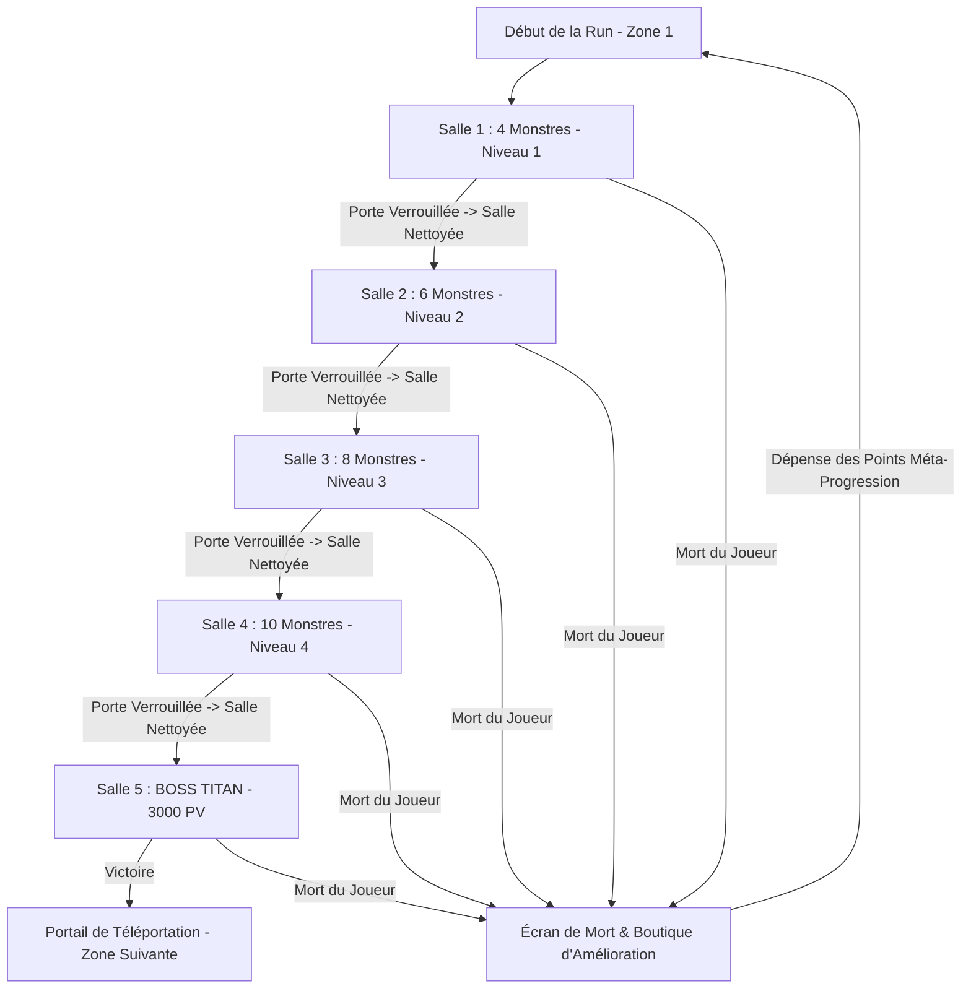

# 🎮 Bullet Drop — Document de Conception & Fonctionnement du Projet

---

## 📌 1. Présentation Générale

* **Nom du jeu :** Bullet Drop
* **Moteur de jeu :** Godot Engine (4.x)
* **Genre :** Top-Down Shooter / Rogue-lite d'Arène
* **Inspirations :** *Gunfire Reborn*, *Brotato*, *Enter the Gungeon*, *Vampire Survivors*
* **Philosophie de production :** Projet conçu **100% sur-mesure** (code, architecture, graphismes, animations, effets visuels et sonores).

---

## 🎯 2. Concept & Boucle de Gameplay (Core Loop)

Le joueur progresse à travers une suite de **5 salles fermées et isolées** composant la Zone 1. À chaque salle franchie, la porte arrière se referme irrévocablement et les monstres deviennent de plus en plus puissants. La 5ᵉ salle abrite le **Boss Titan**, un adversaire redoutable doté de deux armes et d'attaques de zone dévastatrices.

---

## 👤 3. Fiche de Statistiques du Joueur

Le joueur ne gagne pas d'expérience ou de niveaux en plein combat ; ses caractéristiques de base sont déterminées par son statut et améliorées par les drops en cours de run et la méta-progression :

| Statistique | Valeur Initiale | Description & Rôle |
| :--- | :--- | :--- |
| **Points de Vie (PV)** | `100 PV` | Barre de vie principale. |
| **Dégâts de Base** | `120` | Dégâts infligés par chaque projectile non critique. |
| **Chances de Critique** | `0%` | Probabilité d'infliger un coup critique. |
| **Dégâts Critiques** | `+50% (x1.5)` | Multiplicateur appliqué lors d'un coup critique. |
| **Cadence de Tir** | `1 tir / 0.5s` (2 tirs/s) | Temps de recharge entre chaque tir. |
| **Armure** | `0` | Réduit les dégâts reçus de manière proportionnelle. |
| **Bouclier** | `0` | Jauge d'absorption de dégâts prioritaire avant les PV. |
| **Régénération de PV** | `5 PV / sec` | Restauration continue des points de vie. |
| **Vitesse de Déplacement**| `260 px/s` | Vitesse de course standard. |
| **Charges d'Esquive** | `1 charge (2.0s CD)` | Dash d'invulnérabilité directionnel. |

---

## 🚪 4. Structure des Salles & Brouillard de Guerre (Fog of War)

### 4.1. Isolement & Portes Anti-Retour
* **Portes de salle étanches :** Dès que le joueur pénètre dans une salle, la porte d'accès se referme immédiatement et se verrouille pour toujours. Aucun retour en arrière n'est possible.
* **Verrouillage de sortie :** La porte menant à la salle suivante reste fermée et verrouillée tant que tous les ennemis de la salle courante ne sont pas vaincus.
* **Brouillard de guerre 2D :** Chaque salle non encore découverte est plongée dans un épais brouillard noir masquant son contenu (décors, ennemis, disposition). Dès l'entrée du joueur, le voile se dissipe fluidement.

### 4.2. Rythme & Modes d'Apparition des Salles

| Salle | Nom / Environnement | Niveau Monstres | Nb Ennemis | Mode d'Apparition |
| :--- | :--- | :--- | :--- | :--- |
| **Salle 1** | Zone de Départ | **Niveau 1** | 4 | *Apparition immédiate* en bloc. |
| **Salle 2** | Dépôt Ouest | **Niveau 2** | 6 | *2 Vagues successives* de 3 ennemis. |
| **Salle 3** | Grand Hall Central | **Niveau 3** | 8 | *Apparition progressive* (1 ennemi toutes les 1.3s). |
| **Salle 4** | Laboratoire Est | **Niveau 4** | 10 | *2 Vagues intenses* de 5 ennemis rapides. |
| **Salle 5** | Sanctuaire du Boss | **Niveau 5** | Boss (1) | **BOSS TITAN** (3000 PV). |

---

## 👾 5. Progression & Statistiques des Monstres

Les monstres s'adaptent au numéro de la salle selon le fichier `data/monster_stats.json` et la classe `MonsterStatsDatabase.gd` :

| Niveau | PV Max | Dégâts | Cadence de Tir | Vitesse | Points Donnés |
| :---: | :---: | :---: | :---: | :---: | :---: |
| **Niv. 1 (S1)** | 200 | 30 | 1 tir / 1.00s | 95 px/s | 1 pt |
| **Niv. 2 (S2)** | 250 | 36 | 1 tir / 0.95s | 100 px/s | 2 pts |
| **Niv. 3 (S3)** | 300 | 42 | 1 tir / 0.90s | 105 px/s | 3 pts |
| **Niv. 4 (S4)** | 350 | 48 | 1 tir / 0.85s | 110 px/s | 4 pts |
| **Niv. 5 (Minion)** | 400 | 55 | 1 tir / 0.80s | 115 px/s | 5 pts |

### Formule de Calcul des Points Méta :
$$\text{Points Gagnés} = \begin{cases} \text{Niveau du Monstre}, & \text{si Zone } = 1 \\ \text{Niveau du Monstre} \times (3 \times \text{Numéro de Zone}), & \text{si Zone } > 1 \end{cases}$$

---

## 👑 6. Le Boss Titan (Salle 5)

* **Visuel :** Gigantesque cercle rouge doté de 2 armes à feu latérales distinctes et espacées.
* **Points de Vie :** `3000 PV`
* **Dégâts par Balle :** `100 dégâts`
* **Arsenal & Patterns d'Attaque :**
  1. **Tir Double Simultané :** Les deux canons tirent simultanément en ligne droite vers le joueur à intervalle de 0.5s.
  2. **Tir Alterné en Rafale :** Canon gauche puis canon droit tirent à cadence élevée.
  3. **Zone de Balles (AoE Bomb) :** Un cercle rouge d'avertissement s'affiche au sol pendant 1.2s à la position ciblée. À l'impact, une déflagration inflige **100 dégâts instantanés** et projette un anneau de 12 projectiles circulaires.

---

## 🎁 7. Système de Bonus en Cours de Run (Drop à 20%)

À la mort de chaque ennemi, il y a **20% de chance de base** de faire tomber un orbe de bonus (en plus des munitions habituelles) :

1. ⚔️ **+20% Dégâts :** Multiplicateur direct sur les dégâts infligés par l'arme.
2. ❤️ **+50% PV Max & Soin :** Augmente de 50% la réserve de PV et soigne instantanément le joueur.
3. ⚡ **+1 Tir par Seconde :** Augmente la cadence de tir, permettant d'enchaîner plus rapidement les clics.
4. 🛡️ **+20% Bouclier :** Octroie ou renforce le bouclier protecteur (+20 si nul, +20% sinon).
5. 💖 **+50% Régénération PV :** Booste la vitesse de récupération passive (ex: 5 $\to$ 7.5 PV/s).
6. 💨 **+1 Charge d'Esquive :** Ajoute une charge de dash utilisable immédiatement.

---

## 💎 8. Boutique de Méta-Progression Post-Mortem

Accessible après chaque mort ou victoire, la boutique permet de débloquer des bonus permanents sauvegardés dans `user://save_data.json` à travers 4 arbres :

### ⚔️ Arbre d'Attaque (Offensif)
* **Dégâts d'Arme :** +10% de dégâts par niveau (5 niveaux max).
* **Coup Critique % :** +5% de chance de coup critique (5 niveaux max).
* **Dégâts Critique :** +25% de bonus sur les tirs critiques (5 niveaux max).
* **Cadence de Tir :** +10% d'accélération de cadence (5 niveaux max).

### 🛡️ Arbre de Défense (Défensif)
* **Points de Vie Max :** +20 PV de départ par niveau (5 niveaux max).
* **Bouclier Tactique :** +20 Bouclier initial (5 niveaux max).
* **Armure Renforcée :** +5 Armure / réduction de dégâts (5 niveaux max).
* **Régénération de Santé :** +1.5 PV/s de régénération continue (5 niveaux max).

### ⚡ Arbre de Mobilité (Tactique)
* **Charge d'Esquive :** +1 charge consécutive de Dash (2 niveaux max).
* **Récupération d'Esquive :** -15% de temps de recharge par niveau (5 niveaux max).
* **Vitesse de Déplacement :** +8% de vitesse de déplacement (5 niveaux max).

### 📦 Arbre de Ressources (Utilitaire)
* **Aimant à Butin :** +35% de portée d'attraction des drops (5 niveaux max).
* **Réserve de Munitions :** +25 munitions max au départ (5 niveaux max).
* **Chance de Butin :** +5% de chance de faire tomber des bonus (5 niveaux max).
