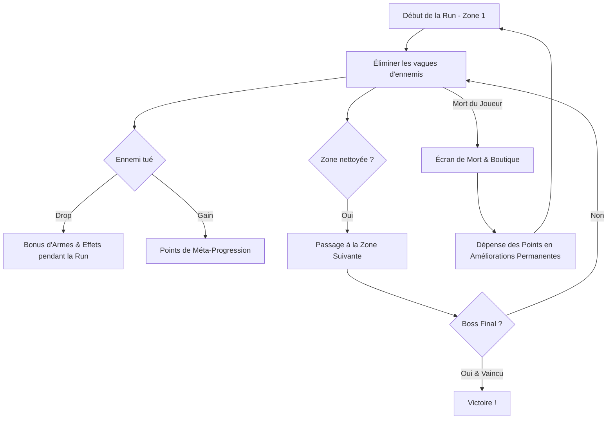

# 🎮 Bullet Drop — Document de Conception & Fonctionnement du Projet

---

## 📌 1. Présentation Générale

* **Nom du jeu :** Bullet Drop
* **Moteur de jeu :** Godot Engine (4.x)
* **Genre :** Top-Down Shooter / Rogue-lite d'Arène
* **Inspirations :** *Brotato*, *Enter the Gungeon*, *Vampire Survivors*
* **Philosophie de production :** Projet conçu **100% sur-mesure** (code, architecture, graphismes, animations, effets visuels et sonores).

---

## 🎯 2. Concept & Boucle de Gameplay (Core Loop)

Le joueur incarne un survivant armé d'une arme à feu évolutive. Il doit nettoyer une succession de zones fermées remplies d'ennemis agressifs jusqu'à atteindre et vaincre le **Boss Final**.



---

## 🔫 3. Mécaniques de Combat & Système d'Arme

### 3.1. Le Joueur & la Survie
* **Point de départ :** Le joueur commence avec **1 seul point de vie (PV)**. La moindre erreur est fatale au départ.
* **Mobilité :** Déplacement multidirectionnel et mécanique d'**esquive (Dash / Roulade)** avec fenêtres d'invulnérabilité.
* **Arme initiale :** Arme à feu avec capacité de chargeur limitée nécessitant un rechargement.

### 3.2. Le Système "Bullet Drop" (Améliorations en Cours de Run)
En tuant des monstres sur le terrain, ces derniers laissent tomber au sol (*drop*) des **bonus d'armes temporaires ou cumulables pour la run en cours** :
* **Dégâts accrus :** Augmentation immédiate des dégâts par balle.
* **Tir en cône (Shotgun spread) :** Dispersion des balles pour toucher plusieurs cibles.
* **Multi-tirs aléatoires :** Ajout de balles supplémentaires projetées dans des directions imprévisibles ou en rafale.
* **Effets élémentaires / Perçants :** Balles rebondissantes, explosives ou traversantes.

---

## 🗺️ 4. Structure des Zones & Progression

### 4.1. Découpage par Zones (Arènes)
* Le jeu est découpé en plusieurs **grandes zones fermées** (à la manière de *Brotato*).
* Chaque zone possède un environnement dégagé permettant le kiting et l'esquive.

### 4.2. Quota d'Ennemis Fixe (Anti-Farm Infini)
* **Pas de farm infini :** Chaque zone génère un **nombre déterminé d'ennemis** (ex: 20 monstres pour une zone donnée).
* Une fois le quota d'ennemis de la zone vaincu, la porte / téléporteur vers la zone suivante s'active.
* Les monstres peuvent arriver par vagues intenses, submergeant le joueur.

### 4.3. Mort Définitive (Permadeath de la Run)
* Si le joueur meurt, la run s'arrête instantanément et il recommence depuis la **Zone 1**.
* Tous les bonus d'armes accumulés au sol pendant la run sont réinitialisés.

---

## 💎 5. Méta-Progression & Boutique Post-Mortem

### 5.1. Récolte et Utilisation des Points
* Chaque monstre abattu rapporte des **Points / Crédits de Méta-progression**.
* Ces points sont sécurisés mais utilisables **UNIQUEMENT après la mort** sur l'écran dédié.

### 5.2. Arbre des Améliorations Permanentes
Les points accumulés permettent de débloquer ou d'augmenter des statistiques persistantes :
1. **Survie :**
   * Vies / Points de vie de départ supplémentaires (passer de 1 PV à 2, 3, etc.).
   * Temps d'invulnérabilité après esquive.
2. **Capacité Offensive :**
   * Dégâts de base de l'arme.
   * Capacité du chargeur (plus de balles avant de recharger).
   * Vitesse de rechargement.
   * Cadence de tir.
   * Chance de tirer plusieurs balles simultanément dès le départ.
3. **Mobilité & Utilitaires :**
   * Réduction du temps de recharge de l'esquive (cooldown).
   * Vitesse de déplacement du personnage.
   * Aimant à drops (rayon de ramassage des points et bonus).

---

## 👾 6. Bestiaire, Dangers & Télégraphie des Attaques

Les ennemis disposent de comportements variés obligeant le joueur à rester constamment en mouvement :

| Type d'Ennemi | Comportement / Attaque | Danger & Contre |
| :--- | :--- | :--- |
| **Tireur à Distance** | Tire des projectiles (lignes droites, salves, tirs prédictifs). | Esquive par déplacement ou dash. |
| **Attaquant de Zone (AoE)** | Lance des attaques au sol couvrant une large zone. | Indicateur au sol (cercle/rectangle rouge) avant impact. Sortir impérativement de la zone. |
| **Brute Corps-à-Corps** | Coup lourd au corps-à-corps avec charge ou balayage. | Télégraphie visuelle du cône d'attaque (telegraphing). Nécessite une esquive réflexe rapide pour éviter le one-shot. |
| **Nuée (Swarmers)** | Monstres rapides et nombreux cherchant à encercler le joueur. | Gestion de foule via tirs en cône et tirs multiples. |
| **Boss Final** | Combinaison de patterns de balles (Bullet Hell), invocations et attaques AoE massives. | Maîtrise totale des esquives, de la gestion du chargeur et des améliorations. |

---

## 🛠️ 7. Architecture Technique Recommandée (Godot 4)

Pour maintenir une base de code propre, modulaire et évolutive, voici la structure de dossiers et de nœuds recommandée :

```text
res://
├── assets/
│   ├── sprites/          # Sprites du joueur, ennemis, armes, projectiles, drops
│   ├── audio/            # Effets sonores (SFX) et musiques (BGM)
│   ├── fonts/            # Polices d'interface UI
│   └── shaders/          # Shaders d'impact, flash blanc, zones d'attaques
├── scenes/
│   ├── core/             # GameManager, SceneTransition, Main.tscn
│   ├── entities/
│   │   ├── player/       # Player.tscn, Player.gd, Hurtbox/Hitbox
│   │   └── enemies/      # BaseEnemy.tscn, MeleeEnemy, RangedEnemy, Boss
│   ├── weapons/          # Weapon.tscn, Bullet.tscn, WeaponDrop.tscn
│   ├── levels/           # BaseZone.tscn, Zone1.tscn, Zone2.tscn, BossRoom.tscn
│   └── ui/               # HUD.tscn, DeathScreen.tscn, UpgradeShop.tscn, MainMenu.tscn
├── scripts/
│   ├── autoloads/        # Global.gd (Sauvegardes, Points), EventBus.gd
│   ├── resources/        # Custom Resources (.tres) pour Stats, Upgrades, WaveConfig
│   └── components/       # HealthComponent, MovementComponent, HitboxComponent
└── project.godot
```

### 🔑 Systèmes Clés à Implémenter :
1. **`EventBus.gd` (Autoload) :** Communication découplée entre l'apparition des drops, la mort des ennemis et l'UI.
2. **`Global.gd` / `SaveSystem.gd` :** Sauvegarde persistante des points acquis et des niveaux d'améliorations débloqués.
3. **`WaveManager.gd` :** Contrôle précis du quota d'ennemis par zone (spawns par vagues, décompte restant, déclenchement de la fin de zone).
4. **`DropSystem` :** Table de loot probabiliste attachée aux ennemis pour générer les bonus d'armes.
5. **`TelegraphComponent` :** Affichage visuel (Polygon2D ou Shaders) des zones d'attaque ennemies avant déclenchement des dégâts.
